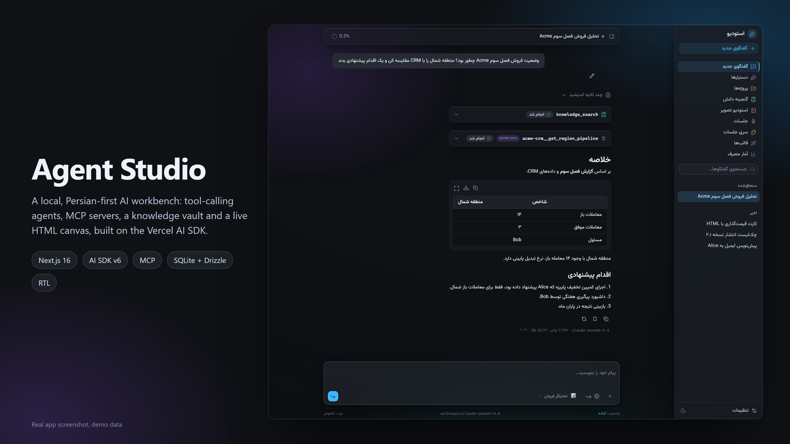
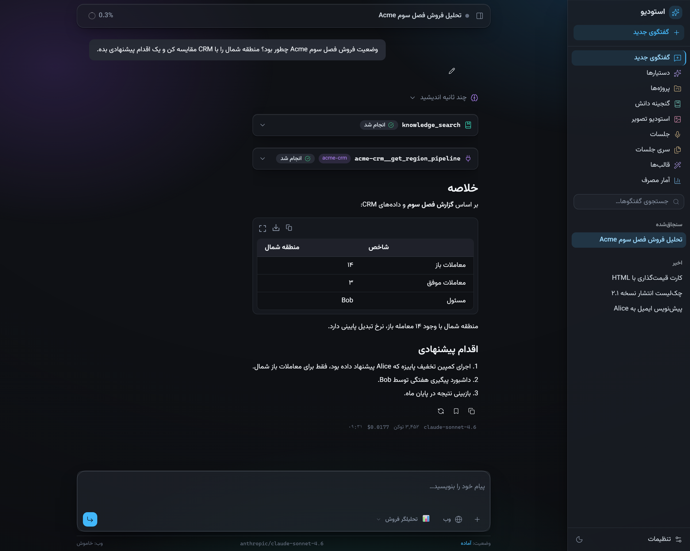
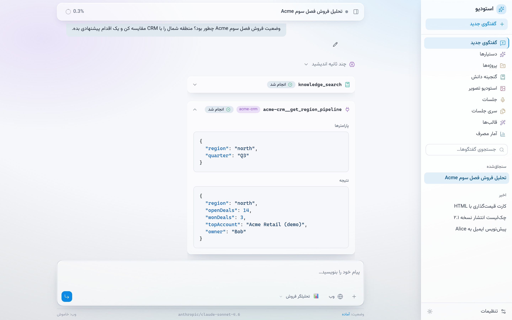
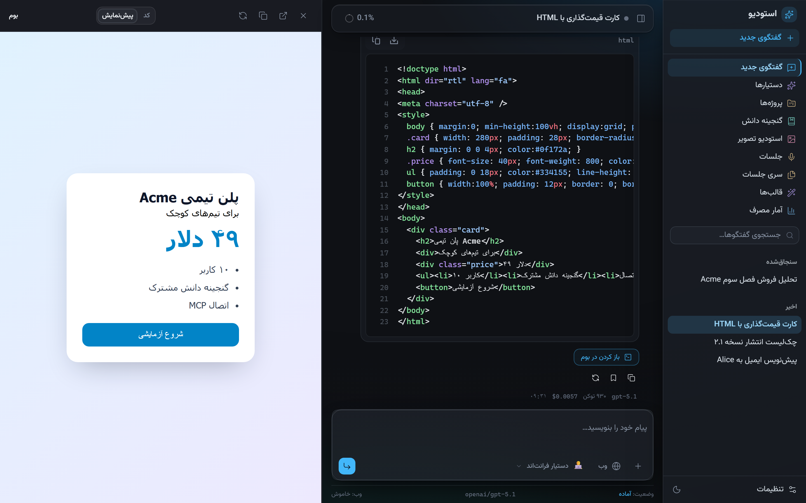
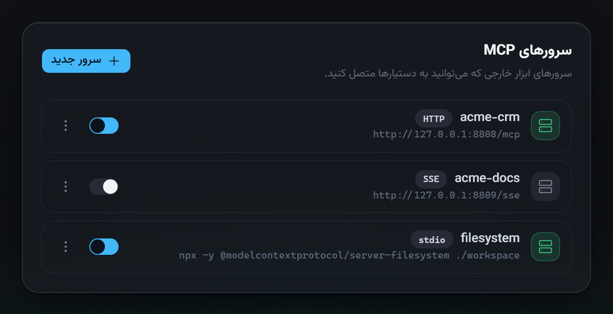
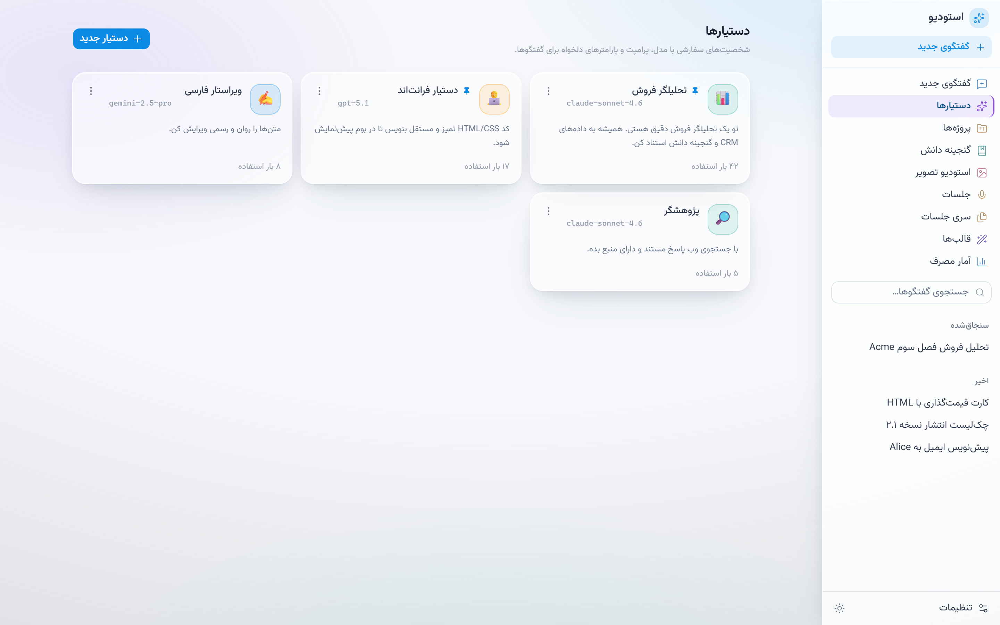
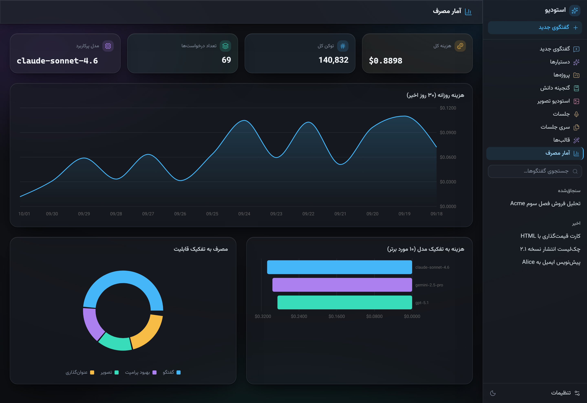
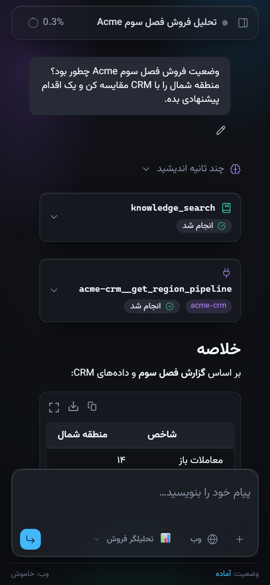
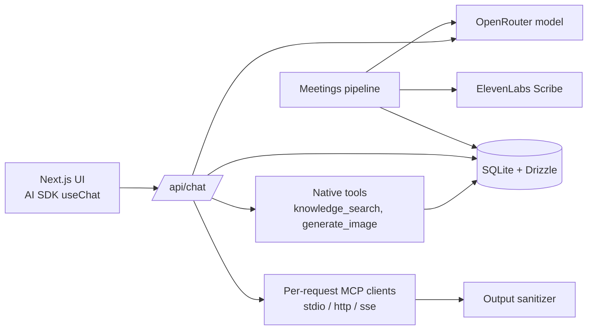

# Agent Studio



**A local, Persian-first AI workbench where agents call native tools and MCP servers, and every step shows up in the chat.**


A local, single-user, Persian-first (RTL) AI workbench built on Next.js and Vercel AI SDK v6: chat with the full OpenRouter catalog, custom assistants with tool calling and MCP servers, a knowledge vault, image studio and a meetings pipeline.

## Highlights

- **Agent loop with visible steps**: reasoning, native tool calls and MCP tool calls render as collapsible cards with their inputs and outputs.
- **MCP done carefully**: per-request clients over stdio, HTTP or SSE, always closed, with an allowlisted child env and an output sanitizer.
- **Per-assistant capabilities**: each assistant picks its model, prompt, native tools and MCP servers.
- **Live HTML canvas**: generated HTML opens in a sandboxed preview next to the chat.
- **Local-first**: SQLite + Drizzle with FTS search, a usage and cost dashboard, no hosted backend.
- **Persian-first UI**: RTL layout, Vazirmatn, light and dark glass themes, responsive down to phone width.

## Screenshots

All screenshots show the real app running locally with synthetic demo data (`scripts/seed-demo.mjs`). The people and companies in them (Acme, Alice, Bob) are made up.

| | |
|---|---|
|  |  |
| **Agent turn**: reasoning, a `knowledge_search` call and an MCP call, then the answer (demo data) | **MCP tool card**: the arguments sent to `acme-crm` and the JSON it returned (demo data, light theme) |
|  |  |
| **Canvas**: a generated HTML snippet rendered in a sandboxed preview (demo data) | **MCP servers**: HTTP, SSE and stdio servers with on/off toggles (demo data) |
|  |  |
| **Assistants**: model, prompt and tools per assistant (demo data) | **Usage**: cost per day, per model and per feature (synthetic usage logs) |

<p align="center"><br><sub>Phone width, same chat (demo data)</sub></p>

## Why it's interesting

- Tool calling with a bounded agent loop: `streamText` with `stopWhen: stepCountIs(5)`, native tools (knowledge search, image generation) plus tools from MCP servers, filtered per assistant and per model capability (`app/api/chat/route.ts`).
- MCP clients are opened per request and always closed, on finish, on error and before the first chunk. One dead server never blocks the others (`lib/mcp/client.ts`).
- MCP child processes get an allowlisted environment, not the app's `process.env`, so API keys do not leak to third-party servers.
- MCP output sanitizer: external tools can return huge payloads (for example megabytes of base64 HTML). The sanitizer parses embedded JSON, decodes base64, strips HTML to text and caps field and total size before the result reaches the model (`lib/mcp/sanitize.ts`).
- Persian-first: RTL layout, Vazirmatn font, Persian UI and prompts, Persian meeting summaries.

## Architecture



The chat route resolves the assistant's config, assembles tools, streams the response and persists the thread and usage in `onFinish`. Meetings run as a detached background pipeline (`uploaded -> transcribing -> summarizing -> done`) that the UI polls.

## Tech stack

Next.js (App Router), React 19, AI SDK v6 (`ai`, `@ai-sdk/react`, `@ai-sdk/mcp`), OpenRouter provider, Drizzle ORM with better-sqlite3 (FTS for the knowledge vault), ElevenLabs Scribe, Tailwind CSS 4, shadcn/Radix UI, AI Elements components, xyflow (`@xyflow/react`) canvas components, Streamdown.

## Key techniques

- Tool calling and step limits: `app/api/chat/route.ts`, `lib/tools-native.ts`, `lib/tools.ts` (typed UI tools).
- MCP lifecycle and env isolation: `lib/mcp/client.ts`.
- Tool-output sanitization: `lib/mcp/sanitize.ts`.
- Meetings: ElevenLabs Scribe transcription then structured summary: `lib/meetings/`.
- Sandboxed HTML canvas preview for generated code: `lib/canvas.ts`, `components/app/code-canvas.tsx`.
- Schema and migrations: `lib/db/schema.ts`, `drizzle/`.

## Getting started

```bash
npm install
cp .env.example .env.local   # set OPENROUTER_API_KEY (and ELEVENLABS_API_KEY for meetings)
npm run dev
```

Open http://127.0.0.1:3000. Data lives in `.data/` (gitignored); delete `.data/studio.db` to reset. Drizzle config is in `drizzle.config.ts` (`npx drizzle-kit generate` for schema changes).

Other scripts: `npm run build`, `npm run lint`.

### Demo data (no API key needed)

The UI can be explored without any key. After the first `npm run dev` (which creates the schema), load the fictional demo data:

```bash
node scripts/seed-demo.mjs
```

It adds conversations with tool calls, assistants, MCP server entries, knowledge items and synthetic usage logs, all with ids prefixed `demo-`; re-running replaces them. Sending new messages still needs `OPENROUTER_API_KEY`.

To regenerate the screenshots (including the hero banner, which frames the chat screenshot), run the dev server on port 4270 (`npm run dev -- -H 127.0.0.1 -p 4270`) and then `node scripts/capture-screenshots.mjs` with Playwright available (`npm i --no-save playwright && npx playwright install chromium`, or point `NODE_PATH` at an existing install).

## Tests

No automated test suite yet; `npx tsc --noEmit`, `npm run lint` and `npm run build` are the available checks. Typecheck and build pass; `npm run lint` currently reports existing React-hooks rule findings.

## License

MIT, see `LICENSE`.

---

<sub>Built by <a href="https://sepehrradmard.ir">Sepehr Radmard</a> · <a href="https://www.linkedin.com/in/sepehr-radmard/">LinkedIn</a> · <a href="https://github.com/sepehr071">GitHub</a> · more projects on my <a href="https://github.com/sepehr071">profile</a></sub>
